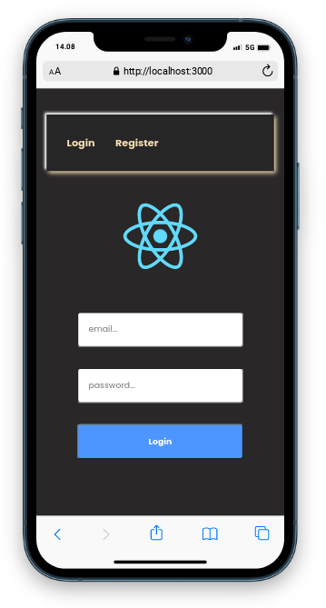
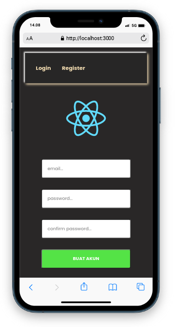

<div align="center">


## PREVIEW
<a href="# Ini hanyalah project sederhana yang menerapkan instegrasi reactjs dengan bantuan axiosjs (nope use fetchjs 😉) penerapan ASYNC request  ,resgister akun dan verifikasi akun bro 😗 (simpel).">

|Signin|Signup|
|:------:|:--------|
|||

</a>


## SINTEM AUTH REACTJS DAN PHP PDO


```txt
    Ini hanyalah project sederhana yang menerapkan instegrasi reactjs dengan bantuan axiosjs (nope use fetchjs 😉)
    penerapan ASYNC request  ,resgister akun dan verifikasi akun bro 😗 (simpel).


    Cara ini juga yang saya akan terapkan kedepan nya menjadi 1 project yang utuh dengan sistem CMS (Content Managent System) dan PWA (Progressive Web App)

    Endpoint Technology And How It Works:
    - PWA
    - AXIOS (ASYNC)
    - PHP PDO (DBMS=MYSQL/opsional) for BACKEND
    - SASS (elegant way of writing css code)
    - REACTJS ( NODEJS library) 
    - yarn (node package menager/npm ? nope. i like neko-chan)
    - react-router-dom
    - poppins font 
    - color theme (by color hunt)
    - Instructions For Errors that are on the form
    - Sistem Alert Notification (Flasher)
    - Hit The API From Outside The Website ~...
```

```txt
Finally Future Auth 16 mei 2023
Touch by RYUGENXD 💦
```

</div> 